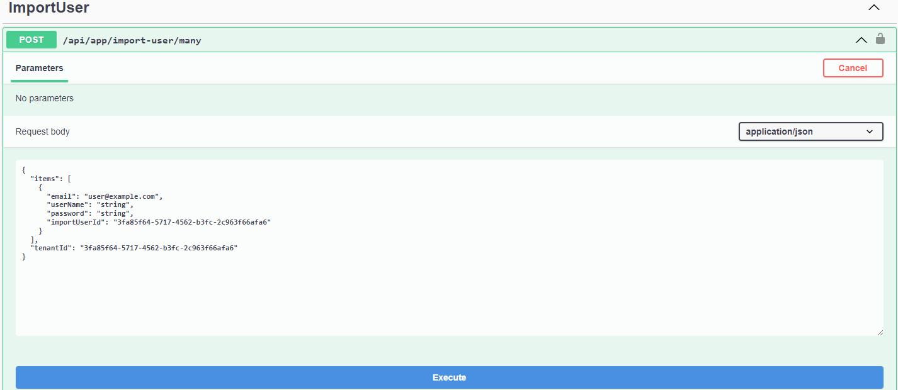

## Import External Users into the Users Table from an ABP Framework application

## Introduction

In this article, I will explain you how you can import users from an external system into the users' table of an ABP Framework application. Watch out, the code in this article is **not production-ready**, as I wanted to keep the example simple to understand.

The sample application has been developed with **Blazor** as UI framework and **SQL Server** as database provider.

## Source Code

The source code of the completed application is [available on GitHub](https://github.com/bartvanhoey/AbpUserImport).

## Requirements

The following tools are needed to run the solution.

- .NET 5.0 SDK
- Vscode, Visual Studio 2019, or another compatible IDE.
- ABP Cli

## Development

### Create a new ABP Framework Application

- Install or update the ABP CLI:

```bash
dotnet tool install -g Volo.Abp.Cli || dotnet tool update -g Volo.Abp.Cli
```

- Use the following ABP CLI command to create a new Blazor ABP application:

```bash
abp new AbpUserImport -u blazor -o AbpUserImport
```

### Open & Run the Application

- Open the solution in Visual Studio (or your favorite IDE).
- Run the `AbpUserImport.DbMigrator` application to apply the migrations and seed the initial data.
- Run the `AbpUserImport.HttpApi.Host` application to start the server-side.

## Add an extra ImportUserId property to the IdentityUser

Open the file **AbpUserImportEfCoreEntityExtensionMappings.cs** in the **EntityFrameworkCore project** and update its content.

```csharp
public static class AbpUserImportEfCoreEntityExtensionMappings
{
    private static readonly OneTimeRunner OneTimeRunner = new OneTimeRunner();

    public static void Configure()
    {
        AbpUserImportGlobalFeatureConfigurator.Configure();
        AbpUserImportModuleExtensionConfigurator.Configure();

        OneTimeRunner.Run(() =>
        {

            // Other code here ...

            // This piece of code adds an extra ImportUserId property to the IdentityUser class
            ObjectExtensionManager.Instance
            .MapEfCoreProperty<IdentityUser, Guid?>(
                "ImportUserId",
                (entityBuilder, propertyBuilder) =>
                {
                    propertyBuilder.HasMaxLength(36);
                }
            );

        });
    }
}
```

## Run DbMigrator project to apply Migrations

In the previous step, we changed our Model, so we need to tell it to EntityFrameworkCore.
Open a command prompt in the EntityFrameworkCore project and enter the command below:

```bash
dotnet ef migrations add ImportUserIdAdded
```

When this command has succeeded, **run the DbMigrator project** to **apply the Database Migrations**.

## IImportUserAppService in Application.Contracts project

Create an **ImportUsers folder** in the **Application.Contracts** project and add an **IImportUserAppService**.
The IImportUserAppService has 1 Method Stub that takes a **CreateImportUserDto**. See below.

```csharp
using System;
using System.Collections.Generic;
using System.ComponentModel.DataAnnotations;
using System.Threading.Tasks;

namespace AbpUserImport.Application.Contracts.ImportUsers
{
    public interface IImportUserAppService
    {
        Task CreateManyAsync(CreateImportUserDto input);
    }

    public class CreateImportUserDto
    {
        public List<ImportUserDto> Items { get; set; }
        public Guid? TenantId { get; set; }
    }

    public class ImportUserDto
    {
        [Required]
        [DataType(DataType.EmailAddress)]
        public string Email { get; set; }

        public string UserName { get; set; }
        
        // Make sure you use a hashed password here
        [Required] public string Password { get; set; } 

        public Guid ImportUserId { get; set; }
    }
}
```

## ImportUserAppService in the Application project

Create an **ImportUsers folder** in the **Application** project and add an **ImportUserAppService** class and paste it into the code below.

In the CreateManyAsync method, we first call the **SetIdentityOptions** method to set the different options for User and Password. Then we loop over every user and call the **InsertImportUserInDatabaseAsync**. In this method, a new IdentityUser is instantiated and the **ImportUserId is set** afterward. Finally, the user is created by calling the **CreateAsync** method of the **IdentityUserManager**.

```csharp
using System;
using System.Threading.Tasks;
using AbpUserImport.Application.Contracts.ImportUsers;
using Microsoft.AspNetCore.Identity;
using Volo.Abp.Data;
using Volo.Abp.Guids;
using Volo.Abp.Identity;
using IdentityUser = Volo.Abp.Identity.IdentityUser;

namespace AbpUserImport.Application.ImportUsers
{
    public class ImportUserAppService : AbpUserImportAppService, IImportUserAppService
    {
        private readonly IGuidGenerator _guidGenerator;
        private readonly IdentityUserManager _identityUserManager;

        public ImportUserAppService(IGuidGenerator guidGenerator, IdentityUserManager identityUserManager)
        {
            _guidGenerator = guidGenerator;
            _identityUserManager = identityUserManager;
        }

        public async Task CreateManyAsync(CreateImportUserDto input)
        {
            using (CurrentTenant.Change(input.TenantId))
            {
                SetIdentityOptions();
                foreach (var item in input.Items)
                {
                    await InsertImportUserInDatabaseAsync(item, input.TenantId);
                }
            }
        }
        
        // You will probably need to adapt this method to your needs
        private void SetIdentityOptions()
        {
            _identityUserManager.Options.User.RequireUniqueEmail = true;
            _identityUserManager.Options.User.AllowedUserNameCharacters = $"{_identityUserManager.Options.User.AllowedUserNameCharacters}"; // add special characters here!
            _identityUserManager.Options.Password.RequireDigit = false;
            _identityUserManager.Options.Password.RequireUppercase = false;
            _identityUserManager.Options.Password.RequireNonAlphanumeric = false;
            _identityUserManager.Options.Password.RequireLowercase = false;
            _identityUserManager.Options.Password.RequiredLength = 1;
        }

        private async Task InsertImportUserInDatabaseAsync(ImportUserDto user, Guid? tenantId)
        {
            var identityUser = new IdentityUser(_guidGenerator.Create(), user.Email, user.Email, tenantId);
            identityUser.SetProperty("ImportUserId", user.ImportUserId.ToString());
            var createdUser = await _identityUserManager.CreateAsync(identityUser, user.Password, false);
            createdUser.CheckErrors();
        }
    }
}

```

## Testing

Start the **AbpUserImport.HttpApi.Host** project to have the **Swagger** page launched.
Navigate to the **ImportUser endpoint** in the Swagger page.

Click first on the **Try it out** button and then on the **Execute** button. The **CreateManyAsync** method in the **ImportUserAppService** will be hit and 1 user will be added to the **AbpUsers** table in the database.



Et voilà! You can now **import users from an external system** into the **AbpUsers** table of the ABP Framework.

Get the [source code](https://github.com/bartvanhoey/AbpUserImport.git) on GitHub.

Enjoy and have fun!
